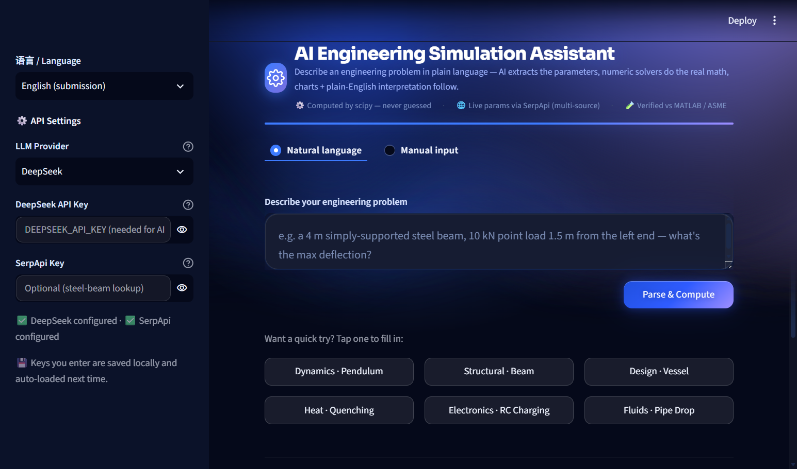
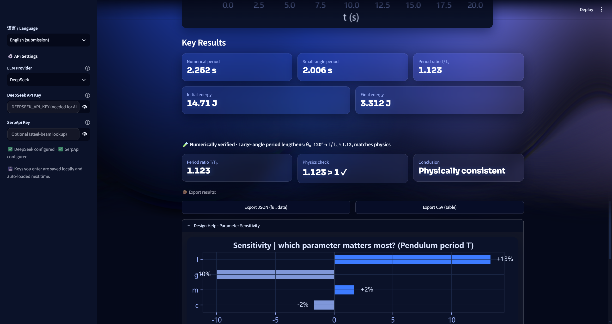
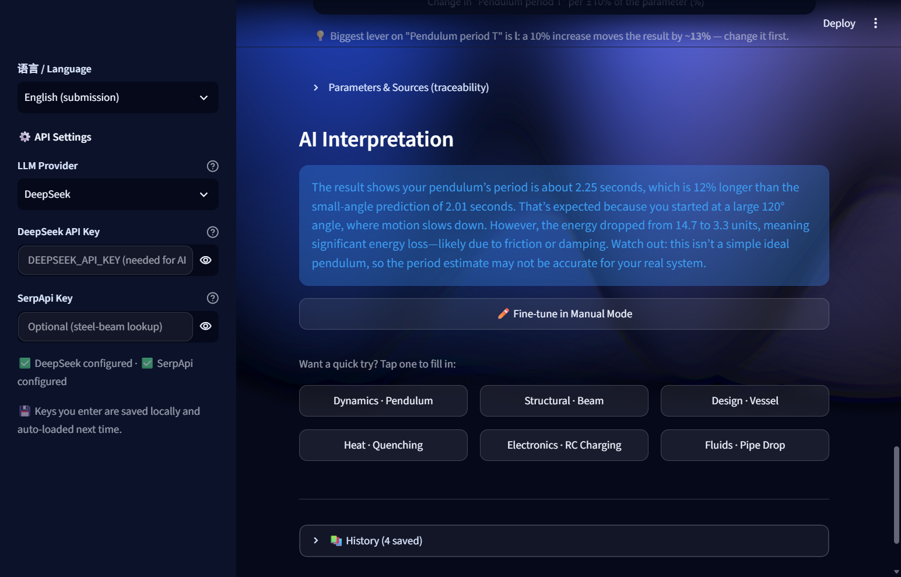
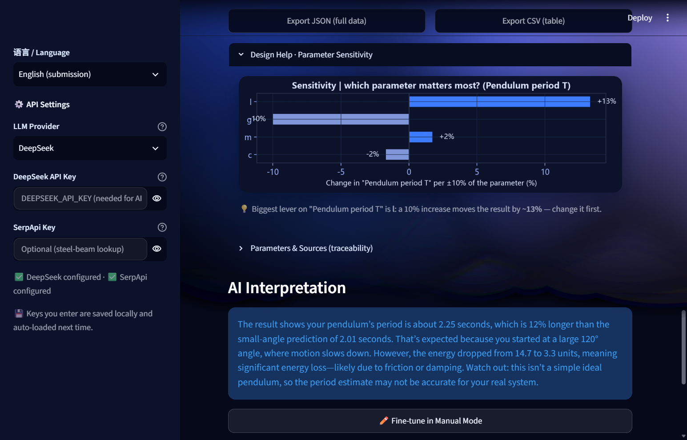

# ⚙️ AI Engineering Simulation Assistant

Describe an engineering problem in plain language → the AI extracts the parameters → scipy solvers compute the real numbers → charts + plain-English interpretation.

**The numbers are never guessed.** The LLM only turns your description into parameters; every value is computed by scipy solvers and cross-checked against verification baselines (MATLAB / ASME standard values).

🌐 **Bilingual UI** — English by default (submission/demo mode), switch to 中文 in the sidebar under "API Settings".

## 🚀 Live Demo

**[https://www.modelscope.cn/studios/likedream/ai-sim-assistant/](https://www.modelscope.cn/studios/likedream/ai-sim-assistant/)** — deployed on ModelScope Studio (no login needed). Works fully without any API key (manual mode + built-in offline NL matcher); with keys in the app's "API Settings" you get AI parsing + live SerpApi parameter lookup.

## Screenshots

| | |
|---|---|
|  |  |
| Landing — natural-language input, six scenario cards, trust badges | Result — chart + metrics, and the live **verification card**: current result vs baseline, ✓/≈/⚠ deviation |
|  |  |
| Every parameter labelled "you provided" vs "engineering default" | Sensitivity tornado — which parameter moves the result most, one-click fix |

## Scenarios (6, across four engineering domains)

| Scenario | Verification baseline |
|---|---|
| Pendulum (Dynamics) | MATLAB `simple_pendulum_cn.m` |
| Steel Quenching (Heat) | MATLAB `heat1d_explicit.m` (same FDM kernel) |
| Beam Deflection (Structural) | MATLAB `beam_deflection.m` |
| Pressure Vessel (Design) | ASME thin-wall standard value |
| RC Charging (Electronics) | Textbook analytic V=Vs(1-e^(-t/τ)); 90% in 0.230 s |
| Pipe Pressure Drop (Fluids) | Darcy-Weisbach + Colebrook; laminar branch 0% error vs Poiseuille |

## Tech Stack

Streamlit · numpy/scipy/matplotlib · LLM (OpenAI-compatible, multiple providers) · SerpApi

## Quick Start

```bash
pip install -r requirements.txt
DEEPSEEK_API_KEY=xxx streamlit run app.py
```

**Runs without any API key**: Manual input mode is fully functional (no AI calls). With a key, AI parsing + plain-language interpretation turn on. Keys can be typed in the sidebar "API Settings" (remembered locally on your machine), or injected via environment variables:

| Provider | Env var | Default model |
|---|---|---|
| DeepSeek | `DEEPSEEK_API_KEY` | deepseek-chat |
| OpenAI | `OPENAI_API_KEY` | gpt-4o-mini |
| Zhipu GLM | `ZHIPU_API_KEY` | glm-4-flash |
| Qwen | `DASHSCOPE_API_KEY` | qwen-plus |
| Kimi | `MOONSHOT_API_KEY` | moonshot-v1-8k |
| SiliconFlow | `SILICONFLOW_API_KEY` | deepseek-ai/DeepSeek-V3 |

## What the AI does (judges' focus)

1. **Understands**: one sentence (Chinese or English) → detects the scenario + extracts parameters (few-shot)
2. **Recommends**: fills in the key parameters you didn't mention with engineering defaults, one click to accept
3. **Never computes**: every number comes from scipy solvers, cross-checked against MATLAB / ASME baselines
4. **Traceable**: the result panel marks every parameter as "you provided" vs "default used"; AI interpretation wraps up in plain language

## Live parameter lookup (SerpApi) — the AI doesn't guess materials either

For five of the six scenarios, one click searches the web for **real engineering values** instead of relying on built-in defaults: steel-beam E/I, steel/aluminum/copper thermal diffusivity, pipe wall roughness, RC component values, and pressure-vessel allowable stress. SerpApi results are **cross-checked across multiple sources into a consensus value** (outliers filtered by each material's physical range), then prefilled with the source links shown. Missing key or network? It gracefully falls back to built-in typical values — the demo never breaks.

## Architecture

```
Natural-language question (EN / 中文)
        │
        ▼
agent/llm.py ── OpenAI-compatible LLM (DeepSeek / OpenAI / Qwen / Kimi / GLM / SiliconFlow)
        │         few-shot prompt → strict JSON {scenario, params, engineering defaults}
        │         (no key / no network → built-in offline rule matcher, same JSON)
        ▼
agent/serpapi.py ── live engineering values (steel E/I, thermal diffusivity, pipe roughness, RC parts, allowable stress)
        │         cross-checked multi-source consensus → prefilled inputs + source links
        │         (missing key / no consensus → graceful fallback to built-in typical values)
        ▼
engine/*.py ── pure numpy/scipy solvers — the LLM never touches a number
        │         pendulum · heat · beam · vessel · rc_circuit · pipe_flow
        ▼
Charts (matplotlib, dark theme) + key metrics + parameter traceability
        + AI plain-language interpretation (agent/llm.py explain)
        + verification card: current result vs MATLAB / ASME baseline, live deviation
```

**The boundary is the point.** Language and math are separated: the LLM understands intent and explains results, but every number is a deterministic scipy solve — so the hallucination risk is bounded to parameter extraction (where LLMs are excellent), while the arithmetic stays verifiable against a stated baseline.

## [API + Cloud + AI] — mapped to the theme

- **API** — the product *is* an API showcase end-to-end: six interchangeable OpenAI-compatible LLM APIs do language→JSON parsing + explanation; SerpApi does live web parameter lookup. A dropdown swaps the provider, and each API's contribution is visible in the UI (source links, provider config).
- **Cloud** — live on ModelScope Studio (cloud-hosted, URL-accessible, no login, no install); SerpApi lookups run server-side against the live web; GitHub Actions CI verifies every push.
- **AI** — the LLM is scoped to what it's great at (intent, parameter extraction, engineering-default recommendation, plain-language explanation) and deliberately barred from arithmetic. That division of labor — and the verification card that proves the numbers were computed, not guessed — is the project's core idea.

## Tests

```bash
python -m pytest tests/ -v
```

190 unit tests (parameter extractors, six engine kernels, E2E, offline fallback) + an AppTest smoke suite that drives the actual Streamlit UI in both languages — CI runs them on every push.

## Competition

DevNetwork [API + Cloud + AI] Hackathon 2026 · submitted for SerpApi Best AI Use Case + Overall Winner
